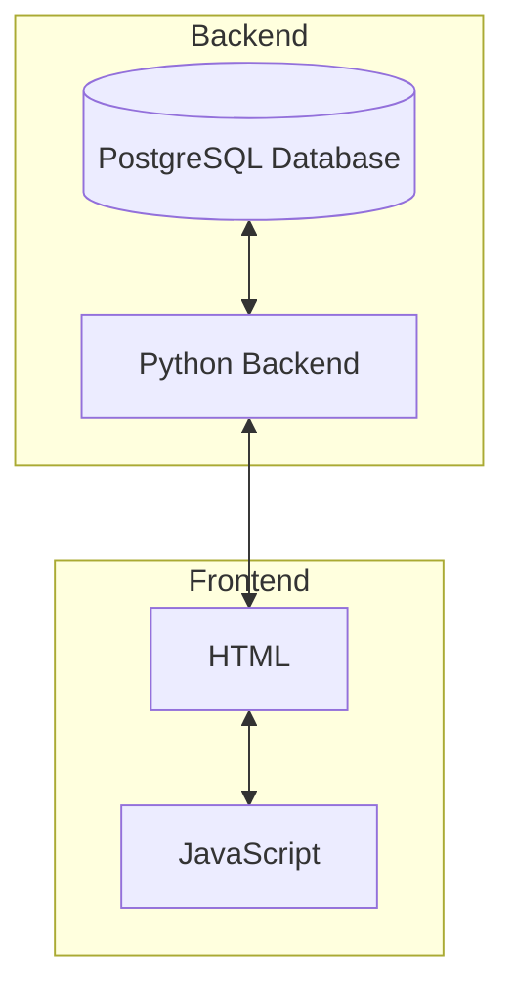
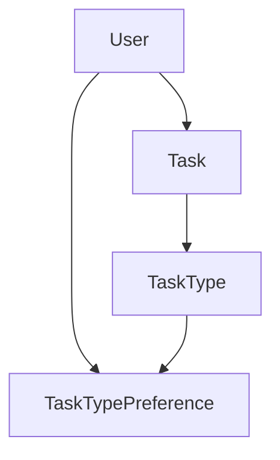
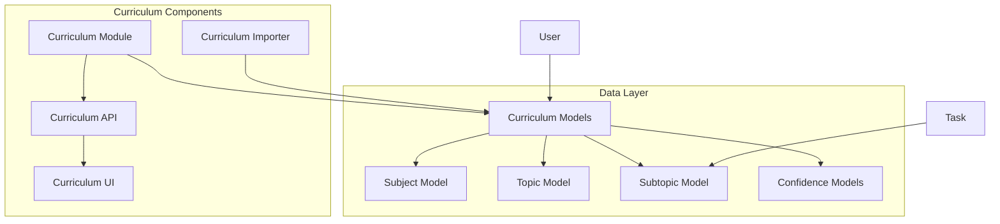
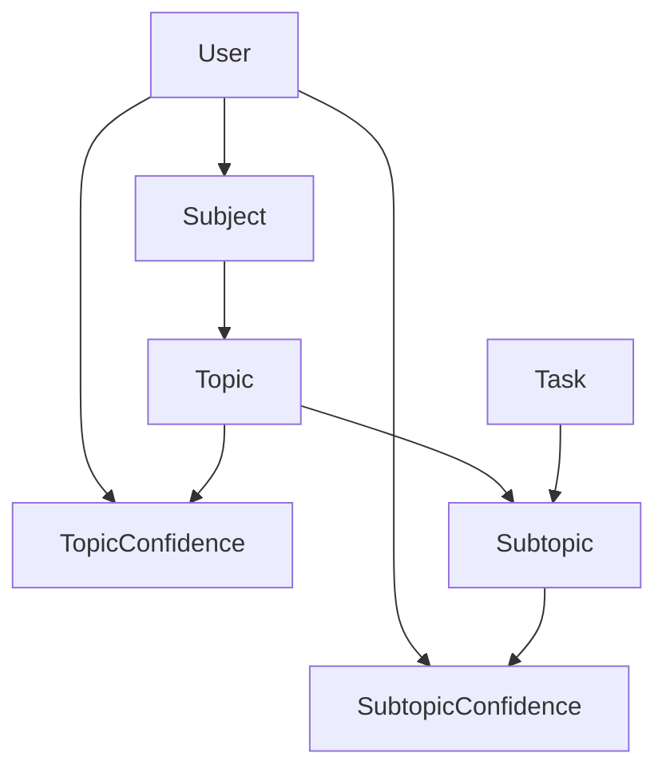

# System Patterns

## System Architecture

The Timetable application follows a client-server architecture with clear separation of concerns:

### Key Components

1. **Data Layer**
   - PostgreSQL database for persistent storage
   - Separate database instances for development, testing, and production environments
   - Data models representing users, tasks, and preferences
   - SQLite used for development with `app.db` in the instance folder

2. **Backend Layer**
   - Python-based server application
   - API endpoints for data retrieval and manipulation
   - Business logic for task scheduling and analytics
   - Authentication and authorization
   - Flask-SQLAlchemy for ORM functionality

3. **Frontend Layer**
   - HTML for structure
   - JavaScript for interactive functionality
   - CSS for styling
   - User interface components for task management and progress tracking

## Design Patterns

### Data Access Patterns
- Repository pattern for database operations
- Data Transfer Objects (DTOs) for transferring data between layers
- Query objects for complex database operations
- SQLAlchemy ORM for database interactions
- Performance optimizations including:
  - Query batching to reduce database roundtrips
  - Caching for frequently accessed data
  - Efficient relationship loading strategies

### Backend Patterns
- RESTful API design for client-server communication
- Service layer pattern to encapsulate business logic
- Dependency injection for modular and testable code
- Environment-specific configuration management for dev/test/prod environments
- Flask Blueprint pattern for route organization
- CLI commands for database initialization and maintenance

### Frontend Patterns
- Component-based UI architecture
- Event-driven communication between components
- Client-side routing for navigation
- State management for UI interactions

## Database Model Relationships

The application uses SQLAlchemy's ORM capabilities to define relationships between models:

### Key Relationship Patterns

1. **One-to-Many Relationships**
   - User to Tasks
   - User to TaskTypePreferences

2. **Many-to-One Relationships**
   - Task to User
   - Task to TaskType
   - TaskTypePreference to User
   - TaskTypePreference to TaskType

3. **Relationship Best Practices**
   - Avoid duplicate relationship definitions between models
   - Use appropriate backref naming to prevent conflicts
   - Consider using back_populates instead of backref for more explicit relationships
   - Implement cascading operations where appropriate (e.g., delete-orphan)
   - Use foreign_keys parameter when multiple relationships reference the same table

## Code Organization

### Backend
- Modular structure with clear separation of concerns
- API controllers separated from business logic
- Database access layer isolated from application logic
- Utility modules for shared functionality
- Models organized by domain (user, task, preferences)

### Frontend
- Component-based organization
- Separation of structure (HTML), behavior (JS), and presentation (CSS)
- Modular JavaScript with clear responsibility boundaries

## Testing Strategy
- Unit tests for individual components
- Integration tests for component interactions
- End-to-end tests for full application workflows
- Separate test database to prevent production data pollution

## Development Workflow
- Feature-based development approach
- Test-driven development encouraged
- Code review process for quality assurance
- Continuous integration for automated testing
- Database initialization and data import CLI commands

## Technical Debt Management
- Regular refactoring to maintain code quality
- File size limits (200-300 lines) to prevent code bloat
- Emphasis on code duplication avoidance
- Documentation of technical decisions and rationale
- Proper error handling, especially for database operations
- Edge case handling in utility functions

## Curriculum Management System

The system architecture has been extended to include a comprehensive curriculum management component:

### Database Model Relationships

### Implemented Features
1. **Subject-Topic-Subtopic Hierarchy**:
   - Subject model represents major study areas
   - Topic model represents subject divisions
   - Subtopic model represents detailed learning units

2. **Confidence Tracking**:
   - Per-user confidence levels for subtopics (1-5 scale)
   - Topic confidence automatically calculated as floating-point average of related subtopics
   - Non-editable topic confidence to maintain data consistency
   - Default subtopic confidence level of 3 (50% capacity)
   - Floating-point confidence visualization (0-100%) for precise confidence representation
   - Color interpolation for smooth visual transitions between confidence levels
   - Radiating animation effect for 100% confidence
   - Historical confidence data storage

3. **Priority System**:
   - Mark topics and subtopics as priority items
   - Prioritization affects task generation
   - Visual indicators for priority status

4. **Curriculum Browser UI**:
   - Three-panel interface for browsing the curriculum
   - Interactive confidence level selection
   - Search functionality across all curriculum items
   - Responsive design for all screen sizes

5. **Data Import System**:
   - JSONC file parsing and importing
   - Validation and error handling
   - CLI commands for database management
   - Support for complex nested structures (e.g., Psychology subjects)

This document outlines the system architecture and key design patterns used in the Timetable application. It serves as a guide for understanding the overall system structure and technical approach.
